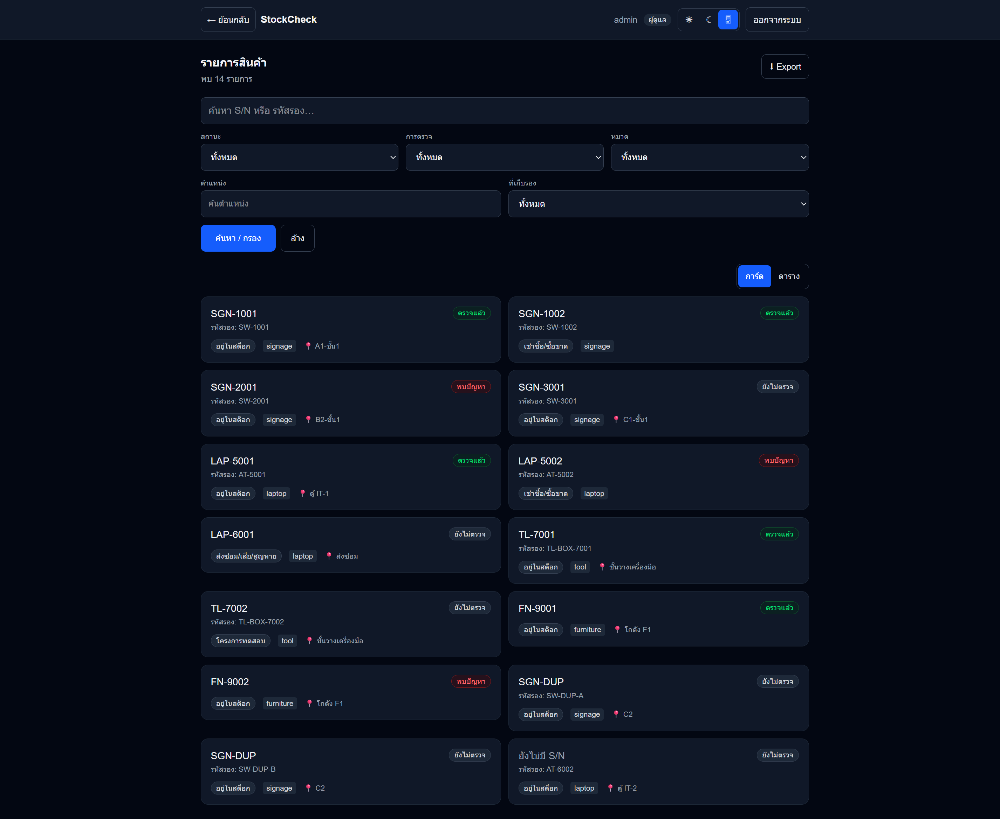
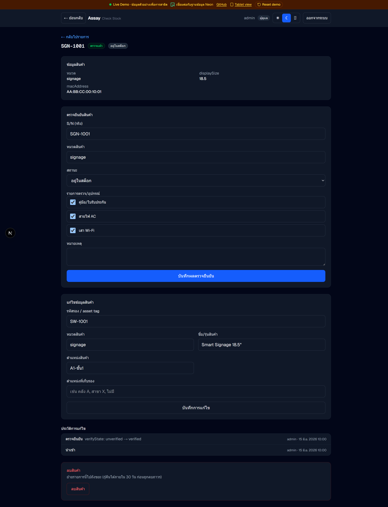

# Assay — Serialized Asset Tracker (Live Demo)

English · **[ภาษาไทย](README-TH.md)**

> A mobile-first tool for small teams to **count, verify, and audit any serialized inventory** — one physical item per row, with a verification workflow and full change history.
> **This is a live demo** that opens instantly with no login wall. It runs on a real PostgreSQL database, and falls back to deterministic in-memory data with zero configuration.

🔗 **Live Demo:** **https://stock-check-xi.vercel.app**
🔑 **Demo access:** click **"เข้าสู่ Live Demo"** for instant admin access, or sign in with `admin` / `admin123` (admin) · `staff` / `staff123` (staff)
🟢 **Live banner:** a persistent top bar (on every screen) carries a green **"connected to Neon"** indicator — the deployed demo runs on real Postgres — plus source / showcase links.
📱 **Tablet showcase:** open **`/showcase`** (or the **"Tablet view"** link in the banner) to use the app inside a tablet bezel — switch between 8.8"/11"/web and rotate, mirroring how it runs in the field.
👤 **By:** Waranyoo Chuathon · [GitHub](https://github.com/WaranyooChuathon)
📐 **Architecture:** see [ARCHITECTURE.md](ARCHITECTURE.md)

---

## Screenshots

| Item list (cards) | Item detail + verify |
|:--:|:--:|
|  |  |

## Overview

Assay tracks inventory as **individual serialized assets** (1 row = 1 real item), not as bulk quantities.
Each item has an identity (serial number, category, specs) and a verification state, so a small team can
walk the shelves, confirm what physically exists against the records, and flag what doesn't.

It's a **generic** tracker: items belong to a free-form **category** (signage, laptop, power tools,
furniture, …), and each category carries its own specs (in a JSON `attributes` field) and its own
verification checklist. The demo is seeded across four categories to show this.

> Origin: adapted from a real internal "Smart Signage stock" tool and generalized into a company-safe
> portfolio demo — every name, serial, and data point here is synthetic.

## The problem it solves

- **You don't know what you have.** Items drift across states — in stock, leased/sold, on trial, in repair/lost — and physical reality stops matching the spreadsheet.
- **A flat spreadsheet isn't enough.** It needs per-item identity, a verification trail, and protection against two people editing the same row.
- **Cleanup must be fast and trustworthy.** Several people verify in parallel; every change is logged; nothing is overwritten silently.

## Features

- **Item list** — search by serial, filter by category / status / verify-state / location, card ⇄ table views with client-side sort, Excel/CSV export.
- **Per-item verify** — record the real serial, category, status, and a category-scoped accessory checklist; auto-flags **discrepancy** when something is missing.
- **Problems view** — every flagged item with reasons, ready to chase down.
- **Excel/CSV import** — upload a sheet and map columns yourself; unmapped columns ride along in `attributes`; messy data (duplicate / blank serials) is imported and flagged, never dropped silently.
- **Soft delete + trash** — deletes are recoverable for a 30-day retention window, then purged (with a permanent archive snapshot).
- **Audit log** — every action (import / verify / edit / delete / restore) recorded with who/when, filterable & paginated.
- **Optimistic locking** — concurrent edits return 409 instead of overwriting.
- **RBAC** — admin vs staff. **Dark mode**, Thai-time formatting, mobile-first throughout.
- **Demo presentation** — a persistent, single-viewport (no-scroll) login with a tech-stack logo marquee, and a sticky "Live Demo" banner with a live Neon-connection badge + source links.

## Tech stack

| Layer | Technology |
|------|-----------|
| Framework | Next.js 16 (App Router, Turbopack) + React 19 + TypeScript |
| Database | PostgreSQL via Prisma 7 (driver adapter `@prisma/adapter-pg`) — **Neon** in production |
| Auth | Auth.js v5 (`next-auth`) — Credentials + JWT |
| Styling | Tailwind CSS 4 + next-themes (dark mode) |
| Import/Export | SheetJS (`xlsx`) · Validation: Zod |
| Tests | Vitest (unit + integration) |
| Deploy | Vercel (region `sin1`) + Vercel Cron |

## Data architecture (production vs demo)

Assay has a **dual-mode data layer**. Every page calls the same service functions in `src/server/*`;
those services switch on `isDemoMode()`:

```
DATABASE_URL set   → real Prisma against PostgreSQL (Neon)     ← production
DATABASE_URL unset → deterministic in-memory mock store        ← CI / local / preview
```

The mock store mirrors the real query/mutation behaviour (optimistic-lock conflicts, discrepancy rules,
soft-delete, audit) so the UI is identical either way — the build passes and the app boots with **no secrets
and no database**. A `/api/demo/reset` endpoint (token-guarded) plus a Vercel Cron re-seed the public demo
so visitor edits never pile up. See [ARCHITECTURE.md](ARCHITECTURE.md).

## Getting started

```bash
npm install

# Quick start — guaranteed no database (in-memory demo data, even if a .env with
# DATABASE_URL exists). Forces DEMO_MOCK=1:
npm run dev:demo     # http://localhost:3000   (pass flags through: npm run dev:demo -- -p 3001)

# Plain dev — honors .env: in-memory when no DATABASE_URL, real DB when it's set:
npm run dev

# With a real database:
cp .env.example .env            # set DATABASE_URL + AUTH_SECRET
npx prisma migrate deploy
npm run db:seed                 # synthetic data across 4 categories
npm run dev
```

Quality gates: `npm run lint` · `npm run typecheck` · `npm run test` · `npm run build`.

## Deploying your own

See **[DEPLOY.md](DEPLOY.md)** for the full runbook (Neon + Vercel). In short: create a personal Neon
project, push to a new GitHub repo, import it on Vercel, and set `DATABASE_URL`, `DIRECT_DATABASE_URL`,
`AUTH_SECRET`, and `DEMO_RESET_TOKEN` (or `CRON_SECRET`). `vercel-build` runs the migration automatically.

---

_This is a portfolio demo built on synthetic data — it is not connected to any company system._
